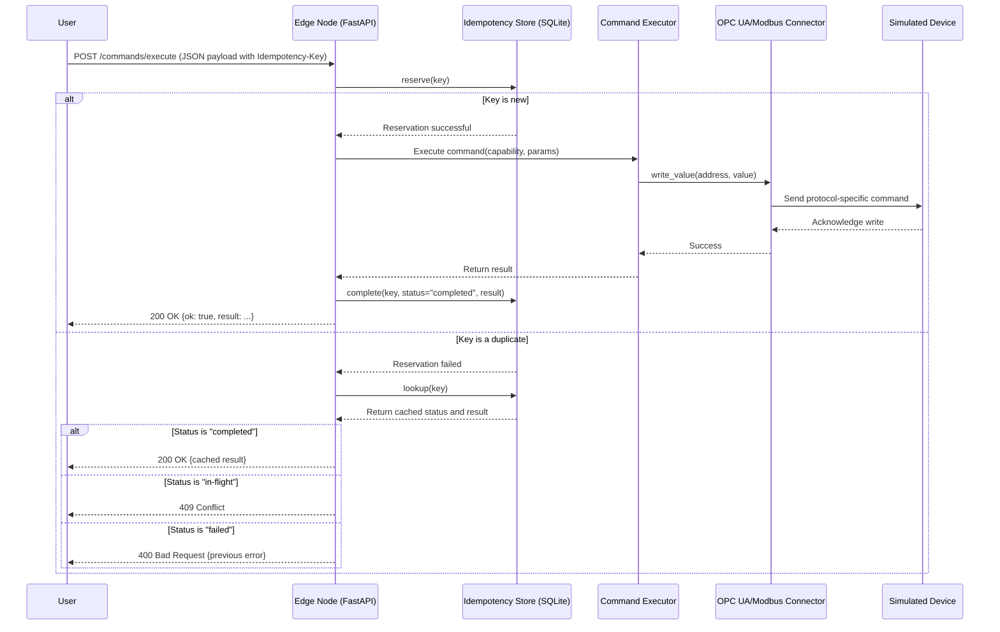

# Tractus Edge - Architecture Design (POC)

This document outlines the comprehensive architecture for the Tractus Edge Proof-of-Concept (POC). The design enables an edge-first system to control industrial devices via a unified API, with built-in safety, observability, and offline capabilities, preparing for future AI integration.

## 1. System Overview

The Tractus Edge POC is designed as a local, vendor-neutral Operations API. It controls simulated industrial devices (OPC UA and Modbus) through a RESTful interface. The core of the system is the **Edge Node**, which handles command validation, execution, idempotency, and metric collection. This local-first approach ensures that the system is resilient to network disruptions. The long-term vision includes a **Control Plane** for fleet management and **AI Components** for advanced capabilities like natural language command processing and anomaly detection.

```mermaid
graph TD
    subgraph "Clients"
        A[User/Script] -->|REST API| B[Edge Node]
    end

    subgraph "Tractus Edge POC"
        B --> C{Command Validation & Policy}
        C --> D[Idempotency Store (SQLite)]
        D --> E[Orchestrator & Executor]
        E --> F[OPC UA Connector]
        E --> G[Modbus Connector]
        B --> H[Metrics (Prometheus)]
    end

    subgraph "Simulated Devices"
        F --> I[OPC UA Simulator]
        G --> J[Modbus-TCP Simulator]
    end

    subgraph "Future Components"
        K[AI Copilot] -.->|JSON| B
        L[Control Plane] <--> B
    end

    style "Future Components" fill:#eee,stroke:#333,stroke-dasharray: 5 5
```

## 2. Technology Stack

### Edge Node Components (Local)

1.  **Edge API & Orchestration**
    -   **Technology**: Python with FastAPI
    -   **Purpose**: Provides the core REST API, validates commands, and orchestrates their execution.
    -   **Key Libraries**:
        -   `fastapi`: For the web framework and automatic API docs.
        -   `uvicorn`: ASGI server to run the application.
        -   `pydantic`: For strict schema validation of commands.
        -   `python-dotenv`: For managing environment configuration.

2.  **Device Connectors**
    -   **Technology**: Python
    -   **Purpose**: Provides modules for communicating with industrial devices.
    -   **Key Libraries**:
        -   `asyncua`: For OPC UA communication (using the sync wrapper for simplicity).
        -   `pymodbus==2.5.3`: For Modbus-TCP communication.

3.  **Idempotency & State Storage**
    -   **Technology**: SQLite
    -   **Purpose**: Stores idempotency keys to prevent duplicate command execution and persists local schedules.
    -   **Key Libraries**:
        -   `sqlite3` (standard library).

4.  **Metrics & Observability**
    -   **Technology**: Prometheus
    -   **Purpose**: Exposes metrics for monitoring and alerting.
    -   **Key Libraries**:
        -   `prometheus-client`: For creating and exposing metrics via an HTTP endpoint.

### Simulated Devices (Local)

1.  **OPC UA Simulator**
    -   **Technology**: Python with `asyncua`
    -   **Purpose**: Simulates an OPC UA server with writable nodes.

2.  **Modbus-TCP Simulator**
    -   **Technology**: Python with `pymodbus`
    -   **Purpose**: Simulates a Modbus slave with writable coils and registers.

## 3. Data Flow

This diagram illustrates the lifecycle of a command sent to the `/commands/execute` endpoint.



## 4. Component Details

### 1. Edge Node

The central component of the POC. It's a single FastAPI application that contains:
-   **REST API**: Exposes endpoints for health checks, metrics, and command execution (`/healthz`, `/metrics`, `/commands/execute`, etc.).
-   **Command Validation**: Uses Pydantic to enforce a strict `CommandBase` schema on all incoming requests.
-   **Idempotency Middleware**: Intercepts commands with an `Idempotency-Key` to prevent duplicate execution by reserving and completing keys in the SQLite database.
-   **Command Executor**: A simple dispatcher (`_execute_capability`) that maps a `capability` string (e.g., `opcua.write@v1`) to the corresponding connector function.
-   **Connectors**: Python modules that abstract the details of the OPC UA and Modbus protocols. The OPC UA client is pooled for performance.

### 2. AI Components (Future)

-   **Copilot**: A service that translates natural language ("turn on the main conveyor") into a valid `CommandBase` JSON object. This JSON is then sent to the Edge Node, which remains the sole authority for validation and execution.
-   **Anomaly Detector**: An engine that monitors time-series data from the Edge Node's metrics to detect operational anomalies and generate guarded recommendations for remediation.
-   **Optimizer**: A deterministic planner (e.g., using OR-Tools) that can take a high-level goal and generate an optimal sequence of commands for the Edge Node to execute.

## 5. Implementation Plan (POC)

### Phase 1: Foundation (Weeks 0-2)
1.  Set up repository and local environment (`.venv`).
2.  Stand up OPC UA and Modbus simulators.
3.  Create the basic FastAPI application with `/healthz` and `/metrics`.
4.  Define the initial `CommandBase` schema in Pydantic.

### Phase 2: Southbound & Core Logic (Weeks 2-4)
1.  Implement OPC UA and Modbus client connectors to read/write to the simulators.
2.  Implement the SQLite-based idempotency store (`reserve`, `complete`, `lookup`).
3.  Create the `_execute_capability` dispatcher.
4.  Develop a comprehensive audit log for all actions.

### Phase 3: Orchestration & Safety (Weeks 4-6)
1.  Implement a local scheduler for offline command execution.
2.  Introduce a simple state machine for command retries and timeouts.
3.  Integrate OPA for basic policy checks (e.g., speed limits).
4.  Build a minimal 2-D Ops Console (React) to view state and issue commands.

### Phase 4: AI Integration & Hardening (Weeks 6-10)
1.  Develop the AI Copilot service to generate command JSON.
2.  Implement the Anomaly Detection engine to monitor metrics.
3.  (Optional) Develop the Optimizer for a simple planning task.
4.  Perform chaos testing to ensure offline resilience and idempotency.

## 6. Security & Safety Considerations (POC Level)

1.  **Idempotency**: Prevents accidental duplicate operations, a critical safety feature.
2.  **Strict Schemas**: Pydantic validation ensures that no malformed commands can be processed.
3.  **Policy Enforcement (OPA)**: Provides a gate to block commands that violate safety rules (e.g., exceeding a speed limit).
4.  **RBAC**: Future work will restrict capabilities based on user roles (e.g., Operator vs. Engineer).
5.  **No Direct AI Control**: AI components can only *propose* commands; the Edge Node always validates and executes them, providing a crucial air gap.
